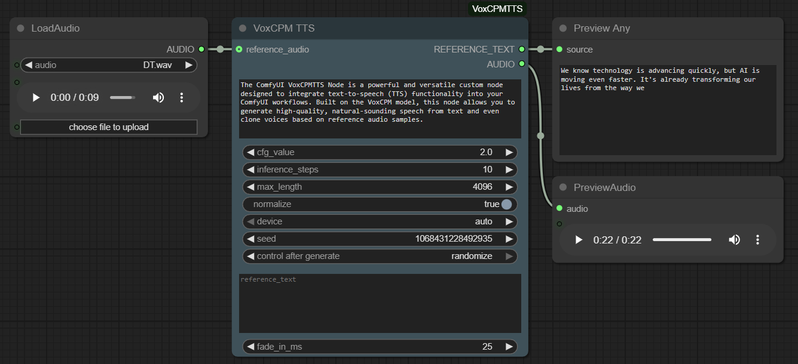

# ComfyUI VoxCPMTTS Node

A clean, efficient ComfyUI custom node for VoxCPMTTS (Text-to-Speech) functionality. This implementation provides high-quality speech generation and voice cloning capabilities using the VoxCPM 0.5B and 1.5 model.

 

## Features

- 🎯 **High-Quality TTS**: Generate natural-sounding speech from text
- 🎭 **Voice Cloning**: Clone any voice using a reference audio sample
- 🔄 **Auto-Transcription**: Automatic speech recognition for reference audio
- ⚡ **Multi-Device Support**: CUDA, MPS, and CPU compatibility
- 🎛️ **Fine-Tuned Control**: Adjustable guidance scale, inference steps, and more
- 🔊 **Audio Post-Processing**: Built-in fade-in to reduce artifacts

## Installation

### Method 1: ComfyUI Manager (Recommended)
1. Open ComfyUI Manager
2. Search for "VoxCPMTTS"
3. Install the node

### Method 2: Manual Installation
1. Navigate to your ComfyUI custom nodes directory:
```bash
cd ComfyUI/custom_nodes/
```

2. Clone this repository:
```bash
git clone https://github.com/1038lab/ComfyUI-VoxCPMTTS.git
```

3. Install dependencies:
```bash
cd ComfyUI-VoxCPMTTS
pip install -r requirements.txt
```

4. Restart ComfyUI

## Dependencies

The node will automatically install required dependencies on first use:
- `huggingface_hub>=0.20.0`
- `einops>=0.6.0`
- `pydantic>=2.0.0`
- `wetext>=0.1.0`
- `faster-whisper`

## Model Download
VoxCPM1.5 (default) will be automatically downloaded to `ComfyUI/models/TTS/VoxCPM1.5/` on first use. VoxCPM-0.5B is no longer used.
https://huggingface.co/openbmb/VoxCPM1.5

## Usage

### Text-to-Speech

1. Add the **VoxCPMTTS** node to your workflow
2. Input your text in the `text` field
3. Adjust parameters as needed:
   - `cfg_value`: Controls adherence to prompt (1.0-10.0, default: 2.0)
   - `inference_steps`: Quality vs speed tradeoff (1-100, default: 10)
   - `max_length`: Maximum token length (256-8192, default: 4096)
4. Connect the audio output to your desired destination

### Voice Cloning

1. Connect a reference audio to the `reference_audio` input
2. Optionally provide `reference_text` (transcript of the reference audio)
   - If left empty, the node will automatically transcribe the audio
3. The generated speech will mimic the reference voice characteristics

### Parameters

| Parameter | Type | Default | Description |
|-----------|------|---------|-------------|
| `text` | STRING | "Hello, this is VoxCPMTTS." | Text to synthesize |
| `cfg_value` | FLOAT | 2.0 | Guidance scale (higher = more prompt adherence) |
| `inference_steps` | INT | 10 | Diffusion steps (higher = better quality) |
| `max_length` | INT | 4096 | Maximum token length |
| `normalize` | BOOLEAN | True | Enable text normalization |
| `seed` | INT | -1 | Random seed (-1 for random) |
| `device` | COMBO | auto | Device selection (auto/cuda/mps/cpu) |
| `reference_audio` | AUDIO | - | Reference audio for voice cloning |
| `reference_text` | STRING | "" | Reference audio transcript |
| `fade_in_ms` | INT | 20 | Fade-in duration (0-1000ms) |

### Outputs

- **REFERENCE_TEXT**: Transcribed or provided reference text
- **AUDIO**: Generated speech audio with 16kHz sample rate

### Environment Variables

Set these environment variables to customize behavior:

```bash
# ASR model size (tiny, small, medium, large)
export VOXCPM_ASR_MODEL=small

# Maximum retry attempts for bad cases
export VOXCPM_RETRY_MAX=2
```

### Device Selection

- `auto`: Automatically selects the best available device
- `cuda`: Force CUDA if available
- `mps`: Force MPS (Apple Silicon) if available
- `cpu`: Force CPU processing

## Example Workflows

### Basic TTS Workflow
```
[Text Input] → [VoxCPMTTS] → [Audio Output]
```

### Voice Cloning Workflow
```
[Reference Audio] → [VoxCPMTTS] ← [Target Text]
                         ↓
                   [Cloned Audio]
```

### Batch Processing Workflow
```
[Text List] → [VoxCPMTTS] → [Audio Batch] → [Save Audio]
```

## Performance Tips

### Memory Optimization
- Use lower `inference_steps` for faster generation
- Choose appropriate `max_length` for your text
- Use CPU device if GPU memory is limited

### Quality Settings
- **Fast**: `cfg_value=1.5, inference_steps=5`
- **Balanced**: `cfg_value=2.0, inference_steps=10` (default)
- **High Quality**: `cfg_value=3.0, inference_steps=20`

### Voice Cloning Tips
- Use high-quality reference audio (16kHz+)
- Reference audio should be 3-30 seconds long
- Clear speech with minimal background noise works best
- Provide accurate reference text when possible

## Troubleshooting

### Common Issues

**Model download fails**
- Check internet connection
- Ensure sufficient disk space (~1.2GB)
- Try clearing the download cache

**Out of memory errors**
- Reduce `max_length`
- Lower `inference_steps`
- Switch to CPU device
- Close other GPU-intensive applications

**Poor voice cloning quality**
- Ensure reference audio is clear and high-quality
- Verify reference text accuracy
- Try different `cfg_value` settings
- Use reference audio from the same speaker

**ASR transcription errors**
- Install `faster-whisper` for better performance
- Provide manual `reference_text` instead
- Use clearer reference audio

### Debug Mode

Enable verbose logging by setting:
```bash
export COMFYUI_LOG_LEVEL=DEBUG
```

## Model Information

This node uses the **VoxCPM1.5** model developed by OpenBMB:

- **Model Size**: ~500M parameters
- **Audio Quality**: 16kHz sample rate
- **Languages**: Primarily optimized for English and Chinese
- **License**: Apache 2.0
- **Paper**: [VoxCPM: A High-Quality Chinese Text-to-Speech Model](https://github.com/OpenBMB/VoxCPM)

## Contributing

Contributions are welcome! Please feel free to submit a Pull Request.

## License

This project is licensed under the Apache License 2.0 - see the [LICENSE](LICENSE) file for details.

## Acknowledgments

- [OpenBMB](https://github.com/OpenBMB) for the VoxCPM model
- [ComfyUI](https://github.com/comfyanonymous/ComfyUI) community
- All contributors and users

## Support

If you encounter any issues or have questions:
- Open an issue on GitHub
- Check the troubleshooting section above
- Join the ComfyUI community discussions

---

**Star this repository if you find it useful! ⭐**
